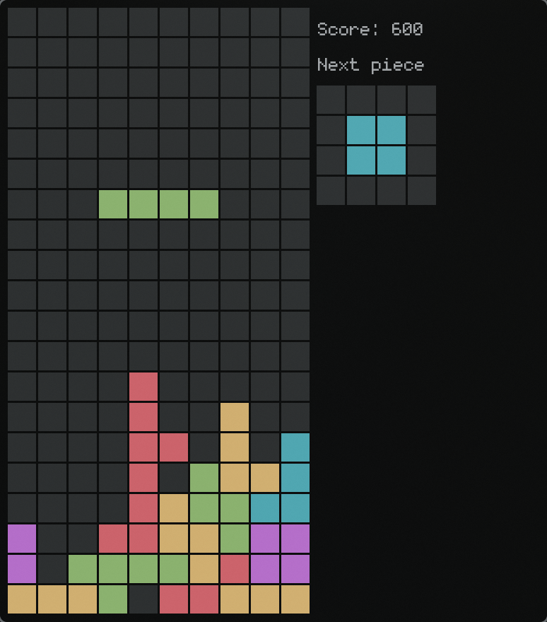

# SFML-Tetris

Ini adalah clone game [tetris](https://en.wikipedia.org/wiki/Tetris) menggunakan bahasa C++
dan library SFML. Program ini mengimplementasikan konsep Pemrograman Berorientasi Objek(PBO) untuk 
mengatur logic aplikasi.

 

Project ini ditujukan untuk project UTS mata kuliah pemrograman berorientasi objek.

## cara menjalankan

1. Install Alat yang di butuhkan

    - gcc (bisa dari mingw bagi pengguna windows)
    - Download CMake dari https://cmake.org/download/ sesuai sistem operasi yang kalian gunakan.

2. Clone repository ini

    ```sh
    git clone https://github.com/usernob/sfml-tetris.git 
    cd sfml-tetris
    ```

3. Generate build folder

    ```sh
    cmake -S . -B build
    ```

4. Build project

    ```sh
    cmake --build build
    ```

5. Jalankan program

    Hasil executable akan berada di folder `build/bin`
    
    **Unix** 
    ```sh
    ./build/bin/tetris
    ```

    **Windows** 
    ```sh
    build/bin/tetris.exe
    ```

## Sumber asset
- https://pixabay.com/music/video-games-retro-game-music-230227/
- https://pixabay.com/sound-effects/retro-video-game-coin-pickup-38299/
- https://pixabay.com/sound-effects/sfx-jump-07-80241/
- https://pixabay.com/sound-effects/game-over-arcade-6435/
